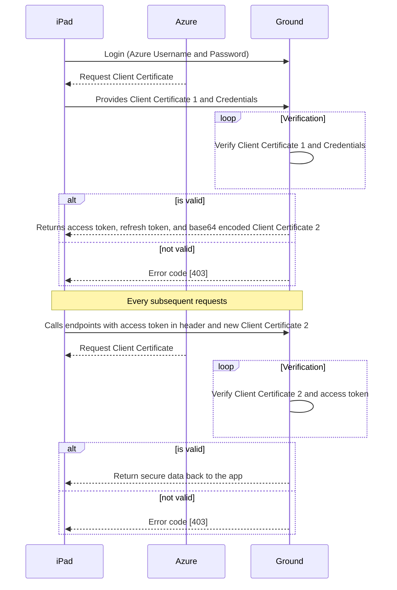

FDA Ground Service

FDA Ground Service is a spring boot application (Ground api to communicate with Azure).

### Tech

FDA ground services requires number of open source projects to work properly:

* Java 1.8
* Apache Maven 3.5.0 
* Apache Tomcat 8.5+

### Prerequistes 
* Non-Boeing internet connection
* Azure account
* Base64 embedded certificate text file (email: [Mihir](mihir.shah@boeing.com) or [Ashwin](ashwin.k.raj@boeing.com))

### Build

```sh
$ cd mobileapi-aad
$ mvn package
$ cp target/*.war to <tomcat home>/webapps
```
### Test (locally)
```sh
$ cp target/*.war to <tomcat home>/webapps
$ cd <tomcat home>/bin
$ startup.sh
$ curl -X POST \
  http://localhost:8080/mobilebackendapi-0.0.1-SNAPSHOT/ \
  -H 'cache-control: no-cache' \
  -H 'content-type: application/json' \
  -H 'x-arr-clientcert: <BASE64 encoded client cert1>' \
  -d '{"azUsername": "<AZURE USERNAME>",
"azPassword": "<AZURE Password>"}'
```
### Test (Azure)
```sh
$ curl  -X POST https://fdagroundtest3.azurewebsites.net/login \
     --cert conf/client1.pfx:password  \
     -H 'Cache-Control: no-cache' -H 'Content-Type: application/json' \
     -d '{"azUsername": "<AZURE USERNAME>", "azPassword": "<AZURE Password>"}'
$ curl  -X POST https://fdagroundtest3.azurewebsites.net/register \
       --cert conf/client1.pfx:password \
      -H 'Cache-Control: no-cache' \
      -H 'Content-Type: application/json'\
      -d '{"azUsername": "<AZURE USERNAME>",
"azPassword": "<AZURE Password>"}'

```



