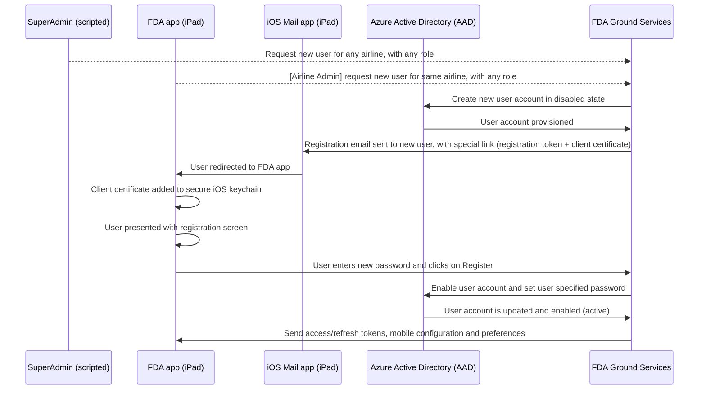
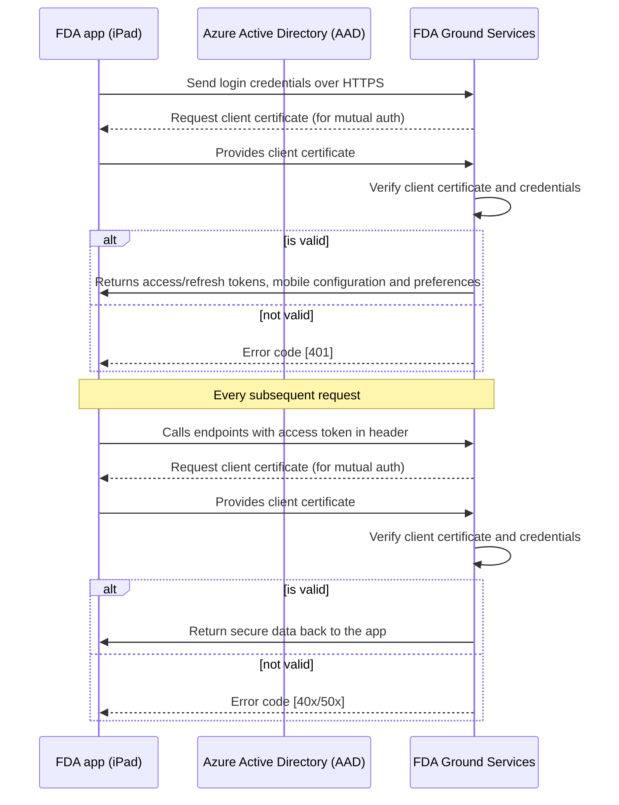

# Ground Service Restful ICD
The FDA ground service consists of  RESTful web services based on Spring Boot specifications. The services are implemented using Java 1.8 and hosted on Tomcat 8.  The system utilizes Azure AD Tenant to control the access to various services.  Currently these services are running on Azure Web App.

## User Account Provisioning and Registration
Currently, user accounts are provisioned manually (curl-style scripts run by SuperAdmin/Boeing users), or via the FDA app (when logged in as an Airline Admin). Below diagram illustrates the user account provisioning and account registration processes.


## User Authentication and Authorization
To use the FDA Ground services, a user must be authenticated and authorized to do so. A user account in the Azure AD tenant is required. Below diagram displays how the users can authenticate to FDA Ground Service (via the FDA app).


## Services
FDA Ground service is provided by RESTful web services.  The base URL for all transactions is `https://<HOST>/<RESOURCE>` where Host is the _hostname_ of the server (Azure App Service in this case) and RESOURCE is a _specific operation_ as documented below. Data is returned as a JSON encoded string.  The HTTP status in the response is also returned as noted below.

All services require a client certificate for authentication when the request is over TLS/SSL. This mechanism is called TLS mutual authentication or client certificate authentication. Additionally, all services except login and register require a valid access token.  This access token must be included in the Authorization header in the HTTP request.  The format of this header is:

	Bearer <accesstoken>

This format must be followed exactly for the user to be properly authenticated.

_Note: To access resources, a valid client certificate must be provided._

# User Account Creation (Airline Admin)
```sh
$ curl -s -X POST "https://HOST/airlinefocaladmin/users" \
       --cert <CERT.p12> --pass <CERT-PASSWORD> \
       -H "Authorization: Bearer <ACCESS-TOKEN>"
       -H 'Cache-Control: no-cache' \
       -H 'Content-Type: application/json' \
       -d '{ \
       		"userPrincipalName": "<NEWUSERNAME>", \
       		"givenName": "<NEWUSERFIRSTNAME>", \
       		"surname": "<NEWUSERSURNAME>", \
       		"displayName": "<NEWUSERDISPLAYNAME>", \
       		"password": "<NEWUSERPASSWORD>", \
       		"forceChangePasswordNextLogin": false, \
       		"otherMails": [ "<NEWUSEREMAIL>" ], \
       		"roleGroupName": "role-<NEWUSERROLE>" \
           }'
```

# User Account Creation (SuperAdmin - Boeing personnel)
```sh
$ curl -s -X POST "https://HOST/superadmin/users" \
       --cert <CERT.p12> --pass <CERT-PASSWORD> \
       -H "Authorization: Bearer <ACCESS-TOKEN>"
       -H 'Cache-Control: no-cache' \
       -H 'Content-Type: application/json' \
       -d '{ \
       		"userPrincipalName": "<NEWUSERNAME>", \
       		"givenName": "<NEWUSERFIRSTNAME>", \
       		"surname": "<NEWUSERSURNAME>", \
       		"displayName": "<NEWUSERDISPLAYNAME>", \
       		"password": "<NEWUSERPASSWORD>", \
       		"forceChangePasswordNextLogin": false, \
       		"otherMails": [ "<NEWUSEREMAIL>" ], \
       		"airlineGroupName": "airline-<NEWAIRLINE>",
       		"roleGroupName": "role-<NEWUSERROLE>" \
           }'
```

### Response of successful user account provisioning
```
HTTP/1.1 200 OK
X-Application-Context: application
Content-Type: application/json;charset=UTF-8
Transfer-Encoding: chunked
{
    "objectId": "...USER-GUID...",
    "objectType": "User",
    "displayName": "NEWUSERFIRSTNAME NEWUSERSURNAME",
    "accountEnabled": "false",
    "city": null,
    "country": null,
    "department": null,
    "dirSyncEnabled": null,
    "facsimileTelephoneNumber": null,
    "givenName": "NEWUSERFIRSTNAME",
    "jobTitle": null,
    "lastDirSyncTime": null,
    "mail": null,
    "mailNickname": "NEWUSERNAME",
    "mobile": null,
    "otherMails": [
        "WORK-EMAIL"
    ],
    "password": null,
    "passwordPolicies": null,
    "physicalDeliveryOfficeName": null,
    "postalCode": null,
    "preferredLanguage": null,
    "state": null,
    "streetAddress": null,
    "surname": "NEWUSERSURNAME",
    "telephoneNumber": null,
    "usageLocation": null,
    "userPrincipalName": "NEWUSERNAME@fdacustomertest.onmicrosoft.com",
    "groups": [
        {
            "objectId": "...GROUP-GUID...",
            "objectType": "Group",
            "displayName": "airline-fda",
            "description": "FDA Airlines (test)",
            "mail": null
        },
        {
            "objectId": "...GROUP-GUID...",
            "objectType": "Group",
            "displayName": "role-airlinepilot",
            "description": "Group for Airline Pilot users",
            "mail": null
        }
    ],
    "roles": [],
    "directoryRoles": []
}
```

### Response of failed user account provisioning
Example: **Invalid password**
```
HTTP/1.1 400
Server: Apache-Coyote/1.1
X-Application-Context: application
Content-Type: application/json;charset=UTF-8
{
    "errorLabel": "CREATE_USER_FAILURE",
    "errorDescription": "Password must contain 8 to 16 characters, which must comprise of at least three out of the four character classes:
	- Uppercase alphabets A to Z
	- Lowercase alphabets a to z
	- Numerals 0 to 9
	- Symbols @ # $ % ^ & * - _ ! + = [ ] { } | \\ : ‘ , . ? / ` ~ “ ( ) ;",
    "failureReason": "BAD_REQUEST",
    "timestamp": 1537400895
}
```

# User Account Registration
```sh
$ curl -s -X POST "https://HOST/registeruser" \
       --cert <CERT.p12> --pass <CERT-PASSWORD> \
       -H 'Cache-Control: no-cache' \
       -H 'Content-Type: application/json' \
       -d '{ \
       		"registrationToken": "<REGISTRATIONTOKEN>", \
       		"username": "<USERPRINCIPALNAME>", \
       		"password":"<USERPASSWORD>"
           }'
```

### Response of successful user account registration
```
HTTP/1.1 200 OK
X-Application-Context: application
Content-Type: application/json;charset=UTF-8
Transfer-Encoding: chunked
{
    "authenticationResult": {
        "accessTokenType": "Bearer",
        "expiresOn": 3600,
        "idToken": "...",
        "userInfo": {
            "uniqueId": "...USER-GUID...",
            "displayableId": "USERNAME@fdacustomertest.onmicrosoft.com",
            "givenName": "USERFIRSTNAME",
            "familyName": "USERSURNAME",
            "identityProvider": null,
            "passwordChangeUrl": null,
            "passwordExpiresOn": null
        },
        "accessToken": "...",
        "refreshToken": "...",
        "multipleResourceRefreshToken": true,
        "expiresAfter": 3600,
        "expiresOnDate": 1537407276194
    },
    "airline": "airline-fda",
    "roles": [
        "role-airlinepilot"
    ],
    "preferences": "...PLIST-BASE64-ENCODED...",
    "mobileConfig": "...MOBILECONFIG-BASE64-ENCODED..."
}
```

### Response of failed user account registation
Example: **Invalid username**
```
HTTP/1.1 400
Server: Apache-Coyote/1.1
X-Application-Context: application
Content-Type: application/json;charset=UTF-8
{
    "errorLabel": "ACTIVATE_USER_ACCOUNT_FAILURE",
    "errorDescription": "Invalid username or password",
    "failureReason": "UNAUTHORIZED",
    "timestamp": 1537404148
}
```

# Login
```sh
$ curl -s -X POST "https://HOST/login" \
       --cert <CERT.p12> --pass <CERT-PASSWORD> \
       -H 'Cache-Control: no-cache' \
       -H 'Content-Type: application/json' \
       -d '{ \
	   	"azUsername": "<USERNAME>", \
	   	"azPassword": "<PASSWORD>" \
	   }'
```

### Response of successful login
```
HTTP/1.1 200 OK
X-Application-Context: application
Content-Type: application/json;charset=UTF-8
Transfer-Encoding: chunked
{
    "authenticationResult": {
        "accessTokenType": "Bearer",
        "expiresOn": 3599,
        "idToken": "...",
        "userInfo": {
            "uniqueId": "...",
            "displayableId": "USERNAME",
            "givenName": "USER-FIRST-NAME",
            "familyName": "USER-LAST-NAME",
            "identityProvider": null,
            "passwordChangeUrl": null,
            "passwordExpiresOn": null
        },
        "accessToken": "...",
        "refreshToken": "...",
        "expiresAfter": 3599,
        "expiresOnDate": 1537386186316,
        "multipleResourceRefreshToken": true
    },
    "airline": "airline-fda",
    "roles": [
        "role-airlinefocal"
    ]
}
```

### Response of unsuccessful login
```
HTTP/1.1 401 Unauthorized
Server: Apache-Coyote/1.1
X-Application-Context: application
Content-Type: application/json;charset=UTF-8
Transfer-Encoding: chunked

{
	"errorLabel":"USER_AUTH_FAILURE",
	"errorDescription":"Invalid username or password",
	"failureReason":"UNAUTHORIZED",
	"timestamp":1537382492
}
```

# New Refresh Token and Access Token
```sh
$ curl -s -X POST https://HOST/refresh \
       --cert <CERT.p12> --pass <CERT-PASSWORD> \
       -H 'cache-control: no-cache' \
       -H 'Content-Type: application/json' \
       -d '{ "refreshToken" : "<REFRESH-TOKEN>" }'
```

### Response for Refresh Token
```
HTTP/1.1 200 OK
X-Application-Context: application
Content-Type: application/json;charset=UTF-8
Transfer-Encoding: chunked
{
	"token_type": "Bearer",
	"expires_in": "3599",
	"expires_on": "1521673565",
	"not_before": "1521669665",
	"access_token": "...",
	"refresh_token": "..."
}
```

### Invalid Response for Refresh
```
HTTP/1.1 400 Bad Request
X-Application-Context: application
Content-Type: application/json;charset=UTF-8
Transfer-Encoding: chunked
{
	"error": "invalid_grant",
	"errorDescription": "AADSTS70000: Transmission data parser failure: Refresh Token is malformed or invalid.",
	"timestamp": 1521670082
}
```


# Upload Flight Record
```sh
$ curl -s -X POST 'https://HOST/uploadFlightRecord' \
       --cert <CERT.p12> --pass <CERT-PASSWORD> \
       -H "Authorization: Bearer <ACCESS-TOKEN>" \
       -H 'Content-Type: multipart/form-data' \
       -F file=@"<FLIGHT-RECORD-NAME>"
```

### Response of successful flight record upload
```
Content-Length: 1854503
Expect: 100-continue
content-type: multipart/form-data; boundary=------------------------833549406b7ecf8d
HTTP/1.1 100 Continue
HTTP/1.1 200 OK
Content-Length: 130
Content-Type: application/json;charset=UTF-8
X-Application-Context: application
{
    "uploaded": true,
    "flightRecordName": "FLIGHT-RECORD-NAME",
    "deletedOnAid": false,
    "message": null
}
```

### Response of failed flight record upload
Example: **Invalid flight record name**
```
Content-Length: 234
Expect: 100-continue
content-type: multipart/form-data; boundary=------------------------acfe467a9e42929c
HTTP/1.1 100 Continue
HTTP/1.1 400  
Content-Length: 151
Content-Type: application/json;charset=UTF-8
X-Application-Context: application
{
    "errorLabel": "FLIGHT_RECORD_UPLOAD_FAILURE",
    "errorDescription": "Empty or invalid file submitted",
    "failureReason": "BAD_REQUEST",
    "timestamp": 1537430189
}
```

# List [Uploaded] Flight Records
```sh
$ curl -s "https://HOST/listFlightRecords" \
       --cert <CERT.p12> --pass <CERT-PASSWORD> \
       -H 'Cache-Control: no-cache' \
       -H 'Content-Type: application/json' \
       -H "Authorization: Bearer <ACCESS-TOKEN>"
```

### Response of flight records listing
```
HTTP/1.1 200 OK
Transfer-Encoding: chunked
Content-Type: application/json;charset=UTF-8
X-Application-Context: application
[
    {
        "uploaded": true,
        "flightRecordName": "FLIGHT-RECORD-NAME-1",
        "deletedOnAid": false,
        "message": null
    },
    {
        "uploaded": true,
        "flightRecordName": "FLIGHT-RECORD-NAME-2",
        "deletedOnAid": true,
        "message": null
    },
    ...
]
```

# Update Flight Record Status (_deleted on AID = true_)
```sh
$ curl -s "https://HOST/updateFlightRecordStatusOnAid" \
       --cert $CERT --pass $CERTPASS \
       -H "Authorization: Bearer <ACCESS-TOKEN>" \
       -H "Content-Type: application/json" \
       -d '[ "<FLIGHT-RECORD-NAME>" ]'
```

### Response for Flight Record Update
```
HTTP/1.1 200 OK
Content-Length: 132
Content-Type: application/json;charset=UTF-8
X-Application-Context: application
[
    {
        "uploaded": true,
        "flightRecordName": "FLIGHT-RECORD-NAME",
        "deletedOnAid": true,
        "message": null
    }
]
```

### Response for failed Flight Record Update
Example: **Invalid Flight Record Name**
```
HTTP/1.1 200 OK
Content-Length: 155
Content-Type: application/json;charset=UTF-8
X-Application-Context: application
[
    {
        "uploaded": false,
        "flightRecordName": "FLIGHT-RECORD-NAME",
        "deletedOnAid": false,
        "message": "Flight record not found"
    }
]
```

# Get Flight Record Status (_specified set_)
```sh
$ curl -v "https://HOST/getStatusOfFlightRecords" \
       --cert $CERT --pass $CERTPASS \
       -H "Authorization: Bearer <ACCESS-TOKEN>" \
       -H "Content-Type: application/json" \
	   -d '[ \
		"<FLIGHT-RECORD-NAME-1>", \
		"<FLIGHT-RECORD-NAME-2>", \
		"<INVALID-FLIGHT-RECORD-NAME>" \
	       ]'
```

### Response for Flight Record Status
```
HTTP/1.1 200 OK
Content-Length: 457
Content-Type: application/json;charset=UTF-8
X-Application-Context: application
[
    {
        "uploaded": true,
        "flightRecordName": "FLIGHT-RECORD-NAME-1",
        "deletedOnAid": false,
        "message": null
    },
    {
        "uploaded": true,
        "flightRecordName": "FLIGHT-RECORD-NAME-2",
        "deletedOnAid": true,
        "message": null
    },
    {
        "uploaded": false,
        "flightRecordName": "INVALID-FLIGHT-RECORD-NAME",
        "deletedOnAid": false,
        "message": "Missing or invalid flight identifier"
    }
]
```

# List Users (_associated with an Airline_)
```sh
$ curl -s "https://HOST/airlinefocaladmin/users"
       --cert $CERT --pass $CERTPASS \
       -H "Authorization: Bearer <ACCESS-TOKEN>" \
       -H "Content-Type: application/json"
```

### Response for successful listing of users
```
HTTP/1.1 200 OK
Content-Length: 11343
Content-Type: text/plain;charset=UTF-8
X-Application-Context: application
[
    {
        "objectId": "...USER-GUID...",
        "objectType": "User",
        "displayName": "USERDISPLAYNAME",
        "accountEnabled": "true",
        "givenName": "USERFIRSTNAME",
        "mailNickname": "USERNAME",
        "otherMails": [
            "USER-WORK-EMAIL"
        ],
        "surname": "USERSURNAME",
        "userPrincipalName": "USERNAME@fdacustomertest.onmicrosoft.com"
    },
    ...
]
```

# Delete User (_by an Airline Admin_)
```sh
$ curl -s -X DELETE "https://HOST/airlinefocaladmin/users/<USER-OBJECTID>" \
       --cert $CERT --pass $CERTPASS \
       -H "Authorization: Bearer <ACCESS-TOKEN>"
```

### Response for successful user deletion
```
HTTP/1.1 204
X-Application-Context: application
```

### Response for failed user deletion
Example: **Invalid User ID specified**
```
HTTP/1.1 404  
Content-Length: 146
Content-Type: application/json;charset=UTF-8
X-Application-Context: application
{
    "errorLabel": "USER_DELETE_FAILED",
    "errorDescription": "No user found with matching identifier",
    "failureReason": "NOT_FOUND",
    "timestamp": 1537456743
}
```

# Delete User (_by a SuperAdmin_)
```sh
$ curl -v -X DELETE "https://HOST/superadmin/users/<USER-OBJECTID>" \
       --cert $CERT --pass $CERTPASS \
       -H "Authorization: Bearer <ACCESS-TOKEN>"
```

### Response for successful user deletion (_by a SuperAdmin_)
```
HTTP/1.1 204
X-Application-Context: application
```

### Response for failed user deletion (_by a SuperAdmin_)
Example: **User already deleted**
```
HTTP/1.1 404  
Content-Length: 146
Content-Type: application/json;charset=UTF-8
X-Application-Context: application
{
    "errorLabel": "USER_DELETE_FAILED",
    "errorDescription": "No user found with matching identifier",
    "failureReason": "NOT_FOUND",
    "timestamp": 1537457024
}
```

# Retrieve Flight Objects (_currently for AMX only_)
```sh
$ curl -v "https://HOST/flight_objects" \
       --cert $CERT --pass $CERTPASS \
       -H "Authorization: Bearer <ACCESS-TOKEN>"
```

### Response for successful retrieval of flight objects (_for AMX only_)
```
HTTP/1.1 200 OK
Content-Length: 38937
Content-Type: application/json;charset=UTF-8
X-Application-Context: application
{
    "data": {
        "perfectFlights": [
            {
                "updatedAt": "2018-09-20T14:56:47.138165",
                "ofpNumber": "0228",
                "insertedAt": "2018-09-20T14:56:47.138163",
                "id": "48719",
                "flightStatus": "Open",
                "flightPlanStatus": null,
                "flightId": "AMX955",
                "estDepartureTime": "2018-09-21T00:52:00.000000",
                "departureAirport": "MMMY",
                "confirmationSignature": null,
                "commercialFlightNumber": "AMX955",
                "arrivalAirport": "MMMX",
                "airlineCode": "AMX",
                "activatedDeviceId": null
            },
	    ...
        ]
    }
}
```

# Retrieve Flight Plan Object, by ID (_currently for AMX only_)
```sh
$ curl -v "https://HOST/flight_objects/<OBJECT-ID>/show" \
       --cert $CERT --pass $CERTPASS \
       -H "Authorization: Bearer <ACCESS-TOKEN>"
```

### Response for successful retrieval of specific flight plan object, by ID (_for AMX only_)
```
HTTP/1.1 200 OK
Content-Length: 38937
Content-Type: application/json;charset=UTF-8
X-Application-Context: application
{
    "data": {
        "perfectFlight": {
            "version": 0,
            "id": "48719",
            "flight": {
                "updatedAt": "2018-09-20T14:56:47.138155",
                "tail": "N784XA",
                "routeString": "MMMY URSU3A URSUR UJ81 SASUT SASU1A MMMX ",
                "route": {...},
                "procedures": {...},
                "preliminary": false,
                "performance": {...}
                "perfInit": {},
                "ofpNumber": "0228",
                "ofc": null,
                "metadata": {...},
                "insertedAt": "2018-09-20T14:56:47.138153",
                "id": "49a52cc8-a557-458e-bb0d-ebebd328b48f",
                "fmcFlightNumber": null,
                "flightStatus": "Open",
                "flightPlanStatus": null,
                "flightObjectId": null,
                "flightId": "AMX955",
                "ewis": null,
                "eet": 3420000,
                "edr": [],
                "confirmationSignature": null,
                "commercialFlightNumber": "AMX955",
                "airlineCode": "AMX",
                "aircraftType": "B737",
                "activatedDeviceId": null
            },
            "airlineCode": "AMX"
        }
    }
}
```

# List SUPA Releases (_for an Airline_)
```sh
$ curl -s "https://HOST/supa-release-mgmt/list?versions=<VERSIONS>" \
       --cert $CERT --pass $CERTPASS \
       -H "Authorization: Bearer <ACCESS-TOKEN>"
```

### Response for successful listing of SUPA Releases (_for an Airline_)
```
HTTP/1.1 200 OK
Content-Length: 38937
Content-Type: application/json;charset=UTF-8
X-Application-Context: application
[
    {
        "release": "5.4.3",
        "partNumber": "BFB58-SUPA-0018",
        "path": "supa-5.4.3-1.noarch.zip",
        "airline": "FDA",
        "file": null
    },
    ...
]
```

# Download SUPA Release (_for an Airline_)
```sh
$ curl -s -OJ "https://HOST/supa-release-mgmt/getRelease/<RELEASE-VERSION>" \
       --cert $CERT --pass $CERTPASS \
       -H "Authorization: Bearer <ACCESS-TOKEN>"
```

### Response for successful download of SUPA Release
```
HTTP/1.1 200 
X-Application-Context: application:localhost
Cache-Control: max-age=0
Content-Disposition: attachment; filename="supa-5.4.3-1.noarch.zip"
Content-Type: application/octet-stream
Content-Length: 57562096
<Binary file stream for download...>
```

### Response for failed download of SUPA Release
```
HTTP/1.1 404 
X-Application-Context: application:localhost
Content-Type: application/json;charset=UTF-8
Transfer-Encoding: chunked
{
    "errorLabel": "SUPA_RELEASE_MGMT",
    "errorDescription": "Missing or invalid SUPA release",
    "failureReason": "NOT_FOUND",
    "timestamp": 1537467116
}
```

# Download TSP (_by Airline_)
**NOTE**: `TAIL` is case sensitive
```sh
$ curl -s 'https://HOST/download?file=<TAIL>.json&type=tsp' \
       --cert $CERT --pass $CERTPASS \
       -H 'Cache-Control: no-cache' \
       -H "Authorization: Bearer <ACCESS-TOKEN>"
```

### Response for successful TSP download
```
HTTP/1.1 200 
X-Application-Context: application:localhost
Cache-Control: max-age=0
Content-Type: application/octet-stream
Content-Length: 553
{
    "_version": 0.3,
    "_date": "2018-08-11T00:00:00.000Z",
    "tail": "TAIL",
    "provideOptimals": true,
    "fuelFlowBetas": [
        1.0193
    ],
    "InfltDB": "37800W.dat",
    "InfltConfig": "06",
    "fuelFlowQstar": 6.4894e-05,
    "weightBetas": [
	...
    ]
}
```

### Response for failed TSP download
```
HTTP/1.1 404 
X-Application-Context: application:localhost
Content-Type: application/json;charset=UTF-8
Transfer-Encoding: chunked
{
    "errorLabel": "FILE_DOWNLOAD_FAILURE",
    "errorDescription": "No file corresponding to specified name TAIL.json and type tsp",
    "failureReason": "NOT_FOUND",
    "timestamp": 1537467852
}
```

# Download FDA App Preferences (_for Carrier_)
**NOTE**: `CARRIER` is case sensitive
```sh
$ curl -s 'https://HOST/download?file=<CARRIER>.plist&type=preferences' \
       --cert $CERT --pass $CERTPASS \
       -H 'Cache-Control: no-cache' \
       -H "Authorization: Bearer <ACCESS-TOKEN>"
```

### Response for successful download of App Preferences
```
HTTP/1.1 200 
X-Application-Context: application:localhost
Cache-Control: max-age=0
Content-Type: application/octet-stream
Content-Length: 543
<?xml version="1.0" encoding="UTF-8"?>
<!DOCTYPE plist PUBLIC "-//Apple//DTD PLIST 1.0//EN" "http://www.apple.com/DTDs/PropertyList-1.0.dtd">
<plist version="1.0">
<dict>
	<key>AIDProtocolKey</key>
	<string>https</string>
	<key>AIDHostKey</key>
	<string>172.31.1.1</string>
	<key>fuelMileageUnit</key>
	<string>nm100kg</string>
	<key>fuelWeightUnit</key>
	<string>kg</string>
	<key>showFuelVarianceControl</key>
	<true/>
	<key>showRefreshButton</key>
	<true/>
	<key>showCompletedFlights</key>
    <false/>
</dict>
</plist>
```

### Response for failed download of App Preferences
```
HTTP/1.1 404 
X-Application-Context: application:localhost
Content-Type: application/json;charset=UTF-8
Transfer-Encoding: chunked
{
    "errorLabel": "FILE_DOWNLOAD_FAILURE",
    "errorDescription": "No file corresponding to specified name DUMMY.plist and type preferences",
    "failureReason": "NOT_FOUND",
    "timestamp": 1537476141
}
```

# Download Mobile Configuration (_By Carrier_)
**NOTE**: `CARRIER` is case sensitive
```sh
$ curl -s 'https://HOST/download?file=<CARRIER>.mobileconfig&type=config' \
       --cert $CERT --pass $CERTPASS \
       -H 'Cache-Control: no-cache' \
       -H "Authorization: Bearer <ACCESS-TOKEN>"
```

### Response for successful download of mobile configuration
```
 HTTP/1.1 200 
X-Application-Context: application:localhost
Cache-Control: max-age=0
Content-Type: application/octet-stream
Content-Length: 1566
<?xml version="1.0" encoding="UTF-8"?>
<!DOCTYPE plist PUBLIC "-//Apple//DTD PLIST 1.0//EN" "http://www.apple.com/DTDs/PropertyList-1.0.dtd">
<plist version="1.0">
<dict>
	<key>PayloadContent</key>
	<array>
		<dict>
			<key>AutoJoin</key>
			<true/>
			<key>CaptiveBypass</key>
			<false/>
			<key>EncryptionType</key>
			<string>WPA</string>
			<key>HIDDEN_NETWORK</key>
			<false/>
			<key>IsHotspot</key>
			<false/>
			<key>Password</key>
			<string>WIFIPASSWORD</string>
			<key>PayloadDescription</key>
			<string>Configures Wi-Fi settings</string>
			<key>PayloadDisplayName</key>
			<string>Wi-Fi</string>
			<key>PayloadIdentifier</key>
			<string>com.apple.wifi.managed.8D7D66B3-F373-4333-8B03-6714F89A49E2</string>
			<key>PayloadType</key>
			<string>com.apple.wifi.managed</string>
			<key>PayloadUUID</key>
			<string>8D7D66B3-F373-4333-8B03-6714F89A49E2</string>
			<key>PayloadVersion</key>
			<integer>1</integer>
			<key>ProxyType</key>
			<string>None</string>
			<key>SSID_STR</key>
			<string>SUPA-AMX</string>
		</dict>
	</array>
	<key>PayloadDisplayName</key>
	<string>SUPA-AMX</string>
	<key>PayloadIdentifier</key>
	<string>A5468321.32E6420A-6646-4195-B780-DD33303D1AE5</string>
	<key>PayloadOrganization</key>
	<string>Boeing</string>
	<key>PayloadRemovalDisallowed</key>
	<false/>
	<key>PayloadType</key>
	<string>Configuration</string>
	<key>PayloadUUID</key>
	<string>753BE3D0-C008-4BBA-83A7-C12290DB628B</string>
	<key>PayloadVersion</key>
	<integer>1</integer>
</dict>
</plist>
```

### Response for failed download of Mobile Configuration
```
HTTP/1.1 404 
X-Application-Context: application
Content-Type: application/json;charset=UTF-8
Transfer-Encoding: chunked
{
    "errorLabel": "FILE_DOWNLOAD_FAILURE",
    "errorDescription": "No file corresponding to specified name DUMMY.mobileconfig and type config",
    "failureReason": "NOT_FOUND",
    "timestamp": 1537479183
}
```

# List Playback Demo Flights (_for FDA_)
```sh
$ curl -s "https://HOST/playback/list" \
       --cert $CERT --pass $CERTPASS \
       -H "Authorization: Bearer <ACCESS-TOKEN>"
```

### Response for successful listing of playback demo flights (_for FDA_)
```
HTTP/1.1 200 OK
Content-Length: 82
Content-Type: application/json;charset=UTF-8
X-Application-Context: application
[
    {
        "flightStreamName": "StepClimb",
        "path": "StepClimb_FlightStream.txt",
        "file": null
    },
    ...
]
```

# Download Playback Demo Flight Stream (_for FDA_)
```sh
$ curl -s -OJ "https://HOST/playback/getDemoFlight/<FLIGHT-STREAM-NAME>" \
       --cert $CERT --pass $CERTPASS \
       -H "Authorization: Bearer <ACCESS-TOKEN>"
```

### Response for successful download of Demo Flight Stream (_for FDA_)
```
HTTP/1.1 200 OK
Cache-Control: max-age=0
Content-Length: 12455113
Content-Type: application/octet-stream
X-Application-Context: application
Content-Disposition: attachment; filename="StepClimb_FlightStream.txt"
<Binary file stream for download...>
```

### Response for failed download of playback demo flight stream (_for FDA_)
```
HTTP/1.1 404
Content-Length: 163
X-Application-Context: application:localhost
Content-Type: application/json;charset=UTF-8
Transfer-Encoding: chunked
{
    "errorLabel": "PLAYBACK_DEMO_FLIGHT_MGMT",
    "errorDescription": "Missing or invalid demo flight stream identifier",
    "failureReason": "NOT_FOUND",
    "timestamp": 1538155723
}
```

# Common errors

### Invalid Access Token for Authorized Requests
```
HTTP/1.1 400  
Content-Length: 117
Content-Type: application/json;charset=ISO-8859-1
{
	"error": "JWT_ERROR",
	"errorDescription": "<JWT-related-error>",
	"timestamp": 1521669385
}
```

### Missing Access Token for Authorized Requests
```
HTTP/1.1 400  
Content-Length: 112
Content-Type: application/json;charset=ISO-8859-1
{
	"error": "Authorization_Missing",
	"errorDescription": "Must provide a Authorizaiton token",
	"timestamp": 1521669522
}
```

### Invalid certificate at login
```
HTTP/1.1 403  
Content-Length: 115
Content-Type: application/json;charset=ISO-8859-1
{
	"error": "certificate missing",
	"errorDescription": "Must provide a valid client certificate",
	"timestamp": 1521668210
}
```
