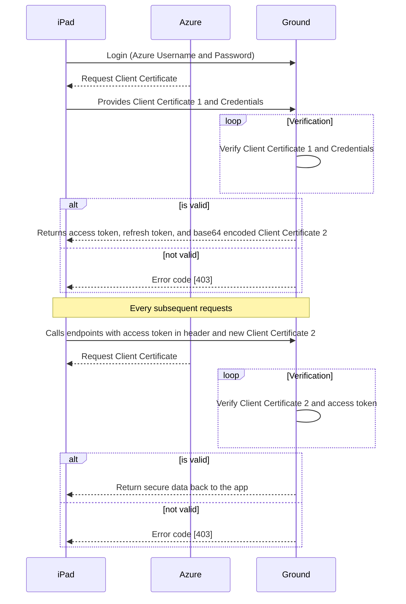

Ground Service Restful IDD
The FDA ground service consists of  RESTful web services based on Spring Boot specifications. The services are implemented using Java 1.8 and hosted on Tomcat 8.  The system utilizes Azure AD Tenant to control the access to various services.  Currently these services are running on Azure Web App.

## Authentication and Authorization
To use the FDA Ground services, a user must be authenticated and authorized to do so. A user account in the Azure AD tenant is required. Currently, user credentials are created manually. Below diagram displays how the users can use the FDA Ground Service.


## Services
FDA Ground service is provided by RESTful web services.  The base URL for all transactions is https://<HOST>/<RESOURCE>  where Host is the host of the services and RESOURCE  is the resource as documented below. Data is returned as a JSON encoded string.  The HTTP status in the response is also returned as noted below.
All services require a client certicate for authentication when the request is over TLS/SSL. This mechanism is called TLS mutual authentication or client certificate authentication. Additionally, all services except login and register require a valid access token.  This access token must be included in the Authorization header in the HTTP request.  The format of this header is:  Bearer accesstoken  This format must be followed exactly for the user to be properly authenticated. 
**Note: To access any resource accesstoken and valid client certificate are required**

### Login
```ssh

```
| Scenario | Response Code | Response 
| - | -| - |
| Valid Login | 200  |
| Invalid Login  | 403 |
### Register
```ssh

```
| Scenario | Response Code | Response 
| - | -| - |
| Valid Login | 200  |
| Invalid Login  | 403 |
### Upload
```sh

```
| Scenario | Response Code | Response 
| - | -| - |
| Valid Login | 200  |
| Invalid Login  | 403 |
### Download
```sh

```
| Scenario | Response Code | Response 
| - | -| - |
| Valid Login | 200  |
| Invalid Login  | 403 |


