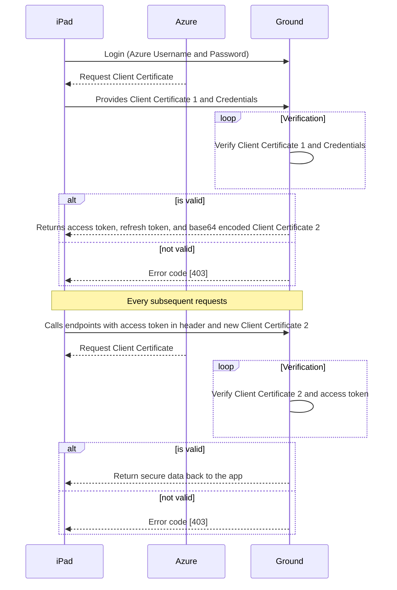

# Ground Service Restful ICD
The FDA ground service consists of  RESTful web services based on Spring Boot specifications. The services are implemented using Java 1.8 and hosted on Tomcat 8.  The system utilizes Azure AD Tenant to control the access to various services.  Currently these services are running on Azure Web App.

## Authentication and Authorization
To use the FDA Ground services, a user must be authenticated and authorized to do so. A user account in the Azure AD tenant is required. Currently, user credentials are created manually. Below diagram displays how the users can use the FDA Ground Service.


## Services
FDA Ground service is provided by RESTful web services.  The base URL for all transactions is `https://<HOST>/<RESOURCE>` where Host is the host of the services and RESOURCE  is the resource as documented below. Data is returned as a JSON encoded string.  The HTTP status in the response is also returned as noted below.
All services require a client certificate for authentication when the request is over TLS/SSL. This mechanism is called TLS mutual authentication or client certificate authentication. Additionally, all services except login and register require a valid access token.  This access token must be included in the Authorization header in the HTTP request.  The format of this header is:  Bearer accesstoken  This format must be followed exactly for the user to be properly authenticated.  ** Note: To access all resource valid client certificate is required **  
** Currently, client certificate 1 is required for Login, Register, and Refresh. Every other resource requires client certificate 2 and valid  access token **

# Request for Login/ Register
```sh
$ curl -s -X POST https://HOST/login --cert client1.pfx --pass "" -H 'Cache-Control: no-cache' -H 'Content-Type: application/json' -d '{ "azUsername": "test1@fdacustomertest.onmicrosoft.com", "azPassword": "Boeing12" }'
```

### Valid response for login
```sh
HTTP/1.1 200 OK
X-Application-Context: application
Content-Type: application/json;charset=UTF-8
Transfer-Encoding: chunked

{
	"authenticationResult": {
		"accessTokenType": "Bearer",
		"expiresOn": 3599,
		"idToken": "...",
		"userInfo": {
			"uniqueId": "6081056b-0a59-4317-bf21-b8deec86be1e",
			"displayableId": "test1@fdacustomertest.onmicrosoft.com",
			"givenName": "Test",
			"familyName": "One",
			"identityProvider": null,
			"passwordChangeUrl": "https://portal.microsoftonline.com/ChangePassword.aspx",
			"passwordExpiresOn": 1522266179876
		},
		"accessToken": "...",
		"refreshToken": "...",
		"multipleResourceRefreshToken": true,
		"expiresAfter": 3599,
		"expiresOnDate": 1521670991876
	},
	"cert": "<base64encoded-string-client-cert2>"
}
```

### Invalid credentials at login
```
HTTP/1.1 401 Unauthorized
Server: Apache-Coyote/1.1
X-Application-Context: application
Content-Type: application/json;charset=UTF-8
Transfer-Encoding: chunked

{
	"error": "invalid_grant",
	"errorDescription": "AADSTS70002: Error validating credentials. AADSTS50126: Invalid username or password",
	"timestamp": 1521667623
}
```

### Valid response for Register
```
HTTP/1.1 200 OK
Transfer-Encoding: chunked
Content-Type: application/json;charset=UTF-8
{
	"authenticationResult": {
		"accessTokenType": "Bearer",
		"expiresOn": 3599,
		"idToken": "...",
		"userInfo": {
			"uniqueId": "6081056b-0a59-4317-bf21-b8deec86be1e",
			"displayableId": "test1@fdacustomertest.onmicrosoft.com",
			"givenName": "Test",
			"familyName": "One",
			"identityProvider": null,
			"passwordChangeUrl": "https://portal.microsoftonline.com/ChangePassword.aspx",
			"passwordExpiresOn": 1522266171253
		},
		"accessToken": "...",
		"refreshToken": "...",
		"multipleResourceRefreshToken": true,
		"expiresOnDate": 1521672113253,
		"expiresAfter": 3599
	},
	"cert": "<base64encoded-string-client-cert2>",
	"preferences": "<base64encoded-string-preferences-plist>",
	"mobileConfig": "<base64encoded-string-mobileconfigprofile-plist>"
}
```

# Request for Download of Files  
** NOTE: `file-name` is case sensitive **
```sh
$ curl -s 'https://HOST/download?file=<file-name>&type=<file-type>' --cert client2.pfx --pass "" -H 'Cache-Control: no-cache' -H 'Authorization: Bearer <access-token>'
```

### Valid Response for Download
```
HTTP/1.1 200 OK
X-Application-Context: application
Content-Type: application/octet-stream
Content-Length: 424
```

### Invalid Response for Download
```
HTTP/1.1 404 Not Found
X-Application-Context: application
Transfer-Encoding: chunked
```

# Request for New Refresh Token and Access Token
```sh
$ curl -s -X POST https://HOST/refresh --cert client1.pfx --pass "" -H 'cache-control: no-cache' -H 'content-type: application/json' -d '{ "refreshToken" : "<refresh-token>" }'
```

### Valid Response for Refresh
```
HTTP/1.1 200 OK
X-Application-Context: application
Content-Type: application/json;charset=UTF-8
Transfer-Encoding: chunked
{
	"token_type": "Bearer",
	"expires_in": "3599",
	"expires_on": "1521673565",
	"not_before": "1521669665",
	"access_token": "...",
	"refresh_token": "..."
}
```

### Invalid Response for Refresh
```
HTTP/1.1 400 Bad Request
X-Application-Context: application
Content-Type: application/json;charset=UTF-8
Transfer-Encoding: chunked
{
	"error": "invalid_grant",
	"errorDescription": "AADSTS70000: Transmission data parser failure: Refresh Token is malformed or invalid.",
	"timestamp": 1521670082
}
```

# Request for File Upload
```sh
$ curl -s -X POST https://HOST/uploadFile --cert client2.pfx --pass "" -H "Authorization: Bearer <access-token>" -H 'content-type: multipart/form-data' -F file=@<absolute-path-of-file> -v
```
### Valid Response for File Upload
```
HTTP/1.1 100 Continue
HTTP/1.1 200 OK
X-Application-Context: application
Content-Type: application/json;charset=UTF-8
Transfer-Encoding: chunked
{
	"message": "Uploaded File: <name-of-file>",
	"adwTransfer": "Success",
	"azureUpload": "Success"
}
```

# Common errors

### Invalid Access Token for Authorized Requests
```
HTTP/1.1 400  
Content-Length: 117
Content-Type: application/json;charset=ISO-8859-1
{
	"error": "JWT_ERROR",
	"errorDescription": "<JWT-related-error>",
	"timestamp": 1521669385
}
```

### Missing Access Token for Authorized Requests
```
HTTP/1.1 400  
Content-Length: 112
Content-Type: application/json;charset=ISO-8859-1
{
	"error": "Authorization_Missing",
	"errorDescription": "Must provide a Authorizaiton token",
	"timestamp": 1521669522
}
```

### Invalid certificate at login
```
HTTP/1.1 403  
Content-Length: 115
Content-Type: application/json;charset=ISO-8859-1
{
	"error": "certificate missing",
	"errorDescription": "Must provide a valid client certificate",
	"timestamp": 1521668210
}
```


